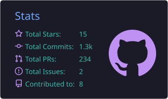
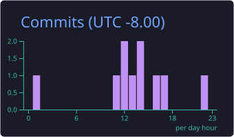
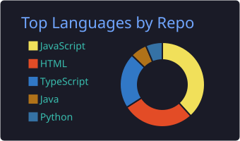
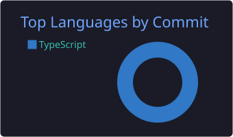
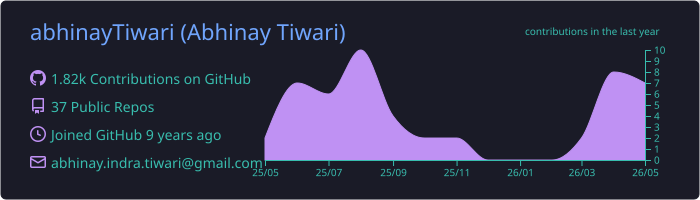

<!-- ═══════════════════════════════════════════════════════════════ -->
<!--           ABHINAY TIWARI  ·  abhinayTiwari/abhinayTiwari     -->
<!-- ═══════════════════════════════════════════════════════════════ -->

<!-- ╔══════════════  ANIMATED HEADER  ══════════════╗ -->


<div align="center">

[](https://git.io/typing-svg)

<br/>

[](https://github.com/abhinayTiwari)
&nbsp;
[](https://github.com/abhinayTiwari)

</div>

---

<!-- ── ABOUT ME ─────────────────────────────────────────────────── -->
## 🤖 `whoami`

```python
class AbhinayTiwari:
    def __init__(self):
        self.name         = "Abhinay Tiwari"
        self.role         = "Full Stack Research Engineer @ NASA AMES"
        self.mission      = "Extensible Traffic Mgmt System — Advanced Air Mobility"
        self.ai_certs     = ["NVIDIA Certified Associate — Generative AI & LLMs"]
        self.languages    = ["JavaScript", "TypeScript", "Python", "GraphQL"]
        self.stack        = ["React", "React Native", "Node.js", "AWS", "MongoDB"]
        self.ai_ml        = ["TensorFlow", "PyTorch", "LLMs", "RAG", "Gen AI"]
        self.research     = ["UAM", "Air Traffic AI", "Autonomous Systems", "ETM"]
        self.off_hours    = ["Tae-Kwon-Do 🥋", "Kick Boxing 🥊", "Hiking 🏔️", "Guitar 🎸"]

    def say_hi(self):
        print("Thanks for stopping by! Let's build something amazing 🚀")

me = AbhinayTiwari()
me.say_hi()
```

<br/>

|  |  |
|---|---|
| 🔭 **Currently** | Building **[Extensible Traffic Management System](https://www.nasa.gov/aam)** for NASA's Advanced Air Mobility Mission |
| 🧠 **AI/ML** | Designing intelligent autonomous air traffic systems using LLMs & computer vision |
| 🎓 **Certified** | NVIDIA Certified Associate — Generative AI & LLMs |
| 🌱 **Learning** | React Native · TypeScript · GraphQL · AWS · Guitar 🎸 |
| 👯 **Collaborate** | JavaScript projects & UAM / AI research |
| ❤️ **Passions** | Tae-Kwon-Do · Kick Boxing · Hiking · Camping |
| 💬 **Ask me** | [Anything here!](https://github.com/abhinayTiwari/abhinayTiwari/issues) |

---

<!-- ── AI & RESEARCH SPOTLIGHT ─────────────────────────────────── -->
## 🧠 AI & Research Spotlight

<div align="center">


<br/><br/>

| 🔬 Research Domain | 🛠️ AI/ML Tools | 🎯 Application Area |
|:---:|:---:|:---:|
| Urban Air Mobility (UAM) | TensorFlow · PyTorch | Autonomous Airspace Management |
| Air Traffic Management | LLMs · RAG Systems | Intelligent Traffic Decisions |
| Upper Class E (ETM) | Computer Vision | Stratospheric Operations |
| Vertiport Automation | AI Agents · Simulation | High-Density Vertiplex Ops |

</div>

---

<!-- ── CERTIFICATIONS & AWARDS ─────────────────────────────────── -->
## 🎓 Certifications & Awards

<div align="center">

<a href="https://www.nvidia.com/en-us/training/certification/">
  
</a>
&nbsp;&nbsp;


<br/><br/>

> 🏅 **Best Paper Award — DASC 2023 · Barcelona**
> _"Airspace Performance Observations of Scalable Autonomous Operations in a High Density Vertiplex Simulation"_

</div>

---

<!-- ── RESEARCH HIGHLIGHTS ─────────────────────────────────────── -->
## 📄 Research Highlights

<div align="center">

[](https://www.nasa.gov/people/abhinay-tiwari/)
&nbsp;&nbsp;
[](https://scholar.google.com/citations?user=hFauDdsAAAAJ&hl=en)

</div>

<br/>

| 📅 | 📑 Publication | 🏛️ Venue |
|:---:|---|:---:|
| 2026 | Coordinating the Sky Above: NASA’s Development and Evaluation of a Cooperative Higher Airspace Traffic Management (HATM) Concept | AIAA AVIATION 2026, SAN DIEGO |
| 2025 | Advancing the Upper Class E Traffic Management (ETM) Concept: NASA's First ETM Collaborative Evaluation with Industry Partners | AIAA AVIATION 2025, Las Vegas |
| 2024 | A Human-In-The-Loop Simulation for Urban Air Mobility in the Terminal Area | DASC 2024, San Diego |
| 2024 | Initial Integration of a Conflict Probabilities Service for Upper Class E Traffic Management | DASC 2024, San Diego |
| 2024 | Initial Development of an Upper Class E Traffic Management (ETM) System for Stratospheric Flight Operations | AIAA AVIATION 2024, Las Vegas |
| 2023 🏅 | **Airspace Performance Observations of Scalable Autonomous Operations in a High Density Vertiplex Simulation** _(Best Paper Award)_ | DASC 2023, Barcelona |
| 2023 | Initial Development and Integration of a Vertiport Automation System for Advanced Air Mobility Operations | AIAA AVIATION 2023, San Diego |

---

<!-- ── TECH ARSENAL ─────────────────────────────────────────────── -->
## 🛸 Tech Arsenal

<div align="center">

**Languages & Frameworks**

[](https://skillicons.dev)

**AI & Machine Learning**

[](https://skillicons.dev)


&nbsp;

&nbsp;

&nbsp;


**Cloud, Databases & DevOps**

[](https://skillicons.dev)

**Tools**

[](https://skillicons.dev)

</div>

---

<!-- ── MISSION CONTROL STATS ───────────────────────────────────── -->
## 📊 Mission Control

<div align="center">

<!-- Row 1: Stats + Productive Time -->

&nbsp;


<br/><br/>

<!-- Row 2: Language Breakdown -->

&nbsp;


<br/><br/>

<!-- Row 3: Full-width Contribution Timeline -->


</div>

<div align="center">
<br/>

[](https://git.io/streak-stats)

</div>

---

<!-- ── TROPHIES ─────────────────────────────────────────────────── -->
## 🏆 Achievements

<div align="center">

[](https://github.com/ryo-ma/github-profile-trophy)

</div>

---

<!-- ── ACTIVITY GRAPH ───────────────────────────────────────────── -->
## 📡 Contribution Radar

<div align="center">

[](https://github.com/ashutosh00710/github-readme-activity-graph)

</div>

---

<!-- ── CONNECT ───────────────────────────────────────────────────── -->
## 🌐 Connect With Me

<div align="center">

<a href="https://twitter.com/intent/follow?screen_name=_abhinayt">
  
</a>
&nbsp;
<a href="https://www.linkedin.com/in/abhinay-tiwari-406181127/">
  
</a>
&nbsp;
<a href="https://github.com/abhinayTiwari">
  
</a>
&nbsp;
<a href="https://www.nasa.gov/people/abhinay-tiwari/">
  
</a>
&nbsp;
<a href="https://scholar.google.com/citations?user=hFauDdsAAAAJ&hl=en">
  
</a>

<br/><br/>

[](https://github.com/abhinayTiwari)
&nbsp;
[](https://github.com/abhinayTiwari)

<br/>


</div>

<!-- Footer Wave -->

