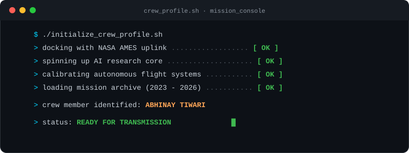
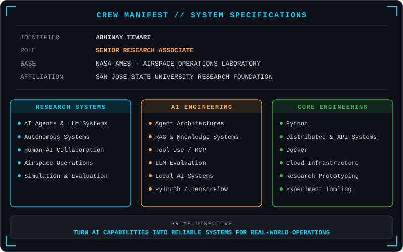
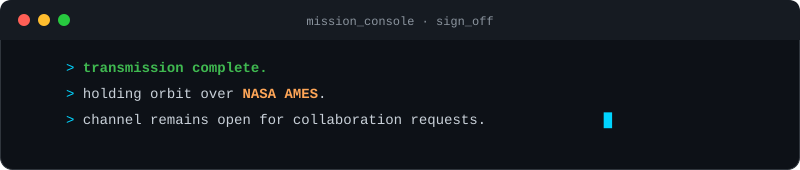

<!-- ═══════════════════════════════════════════════════════════════ -->
<!--     ABHINAY TIWARI  ·  MISSION CONTROL PROFILE  ·  LUNAR OPS   -->
<!-- ═══════════════════════════════════════════════════════════════ -->

<!-- ╔══════════════  ANIMATED HEADER  ══════════════╗ -->

 

&nbsp;

 

### Senior Research Associate · Autonomous Systems · Scientific Simulation Software

**NASA Ames Research Center · Airspace Operations Laboratory**
*(via San José State University Research Foundation)*

I build research-grade AI and autonomous systems that connect **machine intelligence, simulation, operational data, and human decision-making**, bringing an AI research software engineer's approach to real-world autonomy.

---

<!-- ── ABOUT ME ─────────────────────────────────────────────────── -->
## 🛰️ Mission Briefing

I work at the intersection of **AI research, autonomous systems, and production-quality research software**.

Grounded in a software engineering background, I've grown drawn to building the systems around intelligent models: the **agent loops, tools, retrieval pipelines, evaluation infrastructure, simulations, interfaces, and experimental software** required to make AI useful in complex real-world environments.

At NASA Ames, my research engineering work has supported advanced airspace concepts including **Advanced Air Mobility (AAM), Upper Class E / Higher Airspace Traffic Management, Urban Air Mobility, vertiport automation, and increasingly autonomous operations**.

> **Long-term question:** How do we build intelligent systems that can reason, use tools, collaborate with humans, and operate reliably in complex physical environments?

<b>Supporting software engineering stack</b>

 

I also have deep experience building end-to-end software systems with **TypeScript, JavaScript, React, React Native, Node.js, GraphQL, MongoDB, REST APIs, and web application architectures**, useful for turning research algorithms and AI systems into testable tools, operator interfaces, and deployable prototypes.

 

| 📟 Console | Readout |
|---|---|
| 🔭 **Currently** | Building **[Extensible Traffic Management System](https://www.nasa.gov/aam)** for NASA's Advanced Air Mobility Mission |
| 🎓 **Certified** | NVIDIA Certified Associate · Generative AI & LLMs |
| 🌱 **Learning** | LLM Agents · RAG · Transformer Internals · Fine-Tuning |
| 👯 **Collaborate** | AI/ML research projects |
| 💬 **Ask me** | [Anything here!](https://github.com/abhinayTiwari/abhinayTiwari/issues) |

---

<!-- ── RESEARCH DOMAINS ─────────────────────────────────────────── -->
## 🌌 Operational Domains

| Domain | Research / Engineering Focus |
|---|---|
| **Advanced Air Mobility (AAM)** | Scalable operations, autonomy, and future airspace concepts |
| **Higher Airspace / Upper Class E** | Cooperative traffic management for high-altitude operations |
| **Urban Air Mobility (UAM)** | Human-in-the-loop simulation and terminal-area operations |
| **Vertiport Automation** | Automated coordination and high-density operations |
| **Air Traffic Management** | Decision support, conflict management, system integration, and evaluation |
| **Human-AI Systems** | Intelligent assistants and AI-enabled operational workflows |

---

<!-- ── RESEARCH HIGHLIGHTS ─────────────────────────────────────── -->
## 📡 Transmission Log · Research Publications

| Year | Publication | Venue |
|:---:|---|---|
| **2026** | **Coordinating the Sky Above: NASA's Development and Evaluation of a Cooperative Higher Airspace Traffic Management (HATM) Concept** | AIAA AVIATION 2026 · San Diego |
| **2025** | **Advancing the Upper Class E Traffic Management (ETM) Concept: NASA's First ETM Collaborative Evaluation with Industry Partners** | AIAA AVIATION 2025 · Las Vegas |
| **2024** | A Human-In-The-Loop Simulation for Urban Air Mobility in the Terminal Area | DASC 2024 · San Diego |
| **2024** | Initial Integration of a Conflict Probabilities Service for Upper Class E Traffic Management | DASC 2024 · San Diego |
| **2024** | Initial Development of an Upper Class E Traffic Management (ETM) System for Stratospheric Flight Operations | AIAA AVIATION 2024 · Las Vegas |
| **2023 🏅** | **Airspace Performance Observations of Scalable Autonomous Operations in a High Density Vertiplex Simulation** | DASC 2023 · Barcelona |
| **2023** | Initial Development and Integration of a Vertiport Automation System for Advanced Air Mobility Operations | AIAA AVIATION 2023 · San Diego |

> 🏅 **Best Paper Award · DASC 2023, Barcelona**
> *Airspace Performance Observations of Scalable Autonomous Operations in a High Density Vertiplex Simulation*

---

<!-- ── My PUBLISHED COURSES ──────────────────────────────────────────────────── -->
## 🛸 Training Modules · Courses I've Built

I write and publish courses that turn what I learn about AI into structured, executable material for other engineers.

| Course (authored by me) | What it teaches |
|---|---|
| **[AI for Research Engineer · From First Principles](https://abhinaytiwari.github.io/AI-From-First-Principles/)** | Mathematics, probability, neural networks, optimization, and Transformer internals, each with derivations, interactive labs, and executable Python |
| **[Applied AI for Software Engineers](https://abhinaytiwari.github.io/Applied-AI-Course/)** | An end-to-end, tutorial-style course on LLM APIs, agentic systems, RAG, evaluation, safety, and fine-tuning for engineers moving into applied AI |

---

<!-- ── RESEARCH QUESTIONS ───────────────────────────────────────── -->
## 🔭 Deep Space Questions

- How should **AI agents be evaluated** when correctness is not captured by a single benchmark?
- How can LLM-based systems remain **grounded, observable, and controllable** in safety-critical environments?
- What architectures best combine **models, tools, memory, retrieval, simulation, and human oversight**?
- How can AI accelerate **scientific and engineering workflows** without hiding uncertainty?
- How do we move from impressive AI demos to **reliable operational systems**?
- What does scalable autonomy look like when many intelligent agents must share a physical environment?

---

<!-- ── CERTIFICATIONS & AWARDS ─────────────────────────────────── -->
## 🎖️ Commendations & Certifications

  

---

<!-- ── MISSION CONTROL STATS ───────────────────────────────────── -->
## 📊 Telemetry · GitHub Activity

<!-- Row 1: Stats + Productive Time -->

&nbsp;

  

<!-- Row 2: Language Breakdown -->

&nbsp;

  

<!-- Row 3: Full-width Contribution Timeline -->

  

---

<!-- ── TROPHIES ─────────────────────────────────────────────────── -->
## 🏆 Mission Achievements

---

<!-- ── CONNECT ───────────────────────────────────────────────────── -->
## 📡 Open a Channel · Connect

 

### Building at the boundary between AI research and real-world autonomous systems.

*Research → Prototype → Experiment → Evaluate → Iterate*

<!-- Footer Wave -->

